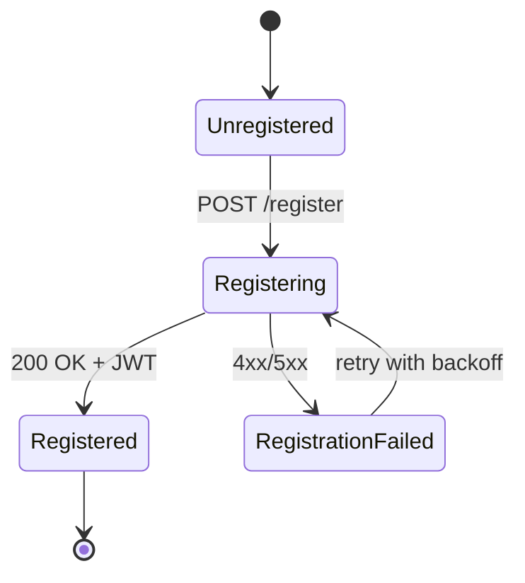
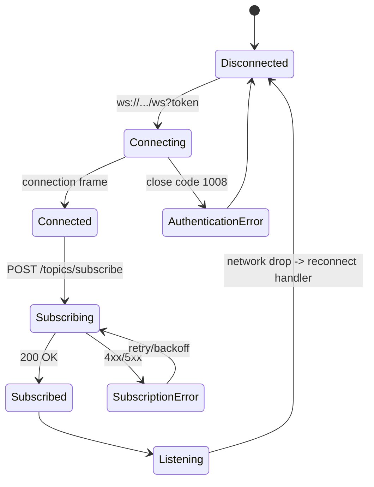
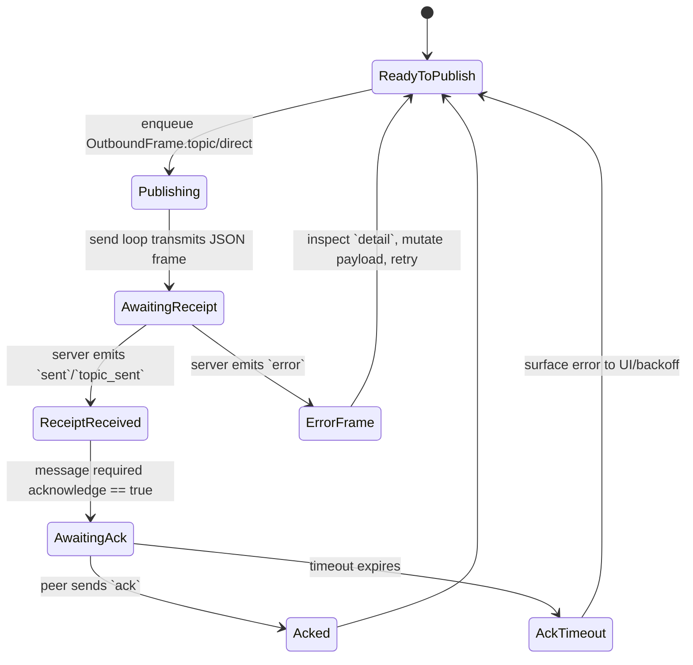
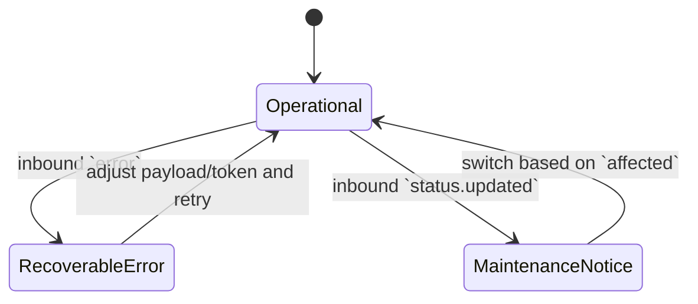

# End-to-End Messaging Flows

This guide illustrates the canonical lifecycle that macOS client engineers should
implement when interacting with Swifty Server. Each section includes a Mermaid
state diagram followed by notes highlighting error handling expectations and
compatibility considerations.

## 1. Registration

- **Happy path:** Send the `ClientRegistrationRequest` payload to `/register`
  and persist the returned JWT for the lifetime of the session.
- **Compatibility:** New optional fields may appear in the response; ignore
  unknown keys to remain forward compatible.
- **Errors:** On HTTP 4xx/5xx parse the `ErrorResponse` body. Retry non-4xx
  failures with exponential backoff and jitter.

## 2. Topic subscription lifecycle

- **Handshake:** Wait for the `connection` frame before issuing subscription
  commands. If the server sends an `error` frame referencing authentication,
  drop the socket and request a fresh JWT.
- **Reconnection:** On disconnect, resume at the `Connecting` state. Reuse the
  same JWT if it is still within TTL; otherwise re-register.

## 3. Publish → Acknowledge sequence

- **Backpressure:** Calls to `send(_:)` suspend when the outbound queue reaches
  capacity. Use `Task` priorities to prevent UI lockups.
- **Delivery receipts:** The client transitions to `ReceiptReceived` when a
  `sent` or `topic_sent` frame is decoded. Attach tracing metadata (such as the
  `msgid`) to correlate UI status indicators.
- **Acknowledgments:** When `acknowledge` is true, maintain a timer that
  resolves once an `ack` frame referencing the same `msgid` arrives. The sample
  Swift client exposes a `PassthroughSubject` so the app can observe these
  events.

## 4. Error propagation

- **Recoverable errors:** Use the `detail` map when present to highlight input
  validation issues. If the frame includes a `msgid`, map it to the pending
  message to avoid duplicate retries.
- **Maintenance notices:** When a `status.updated` frame arrives, consult the
  included version strings to decide whether to re-register or renegotiate
  topic subscriptions.

